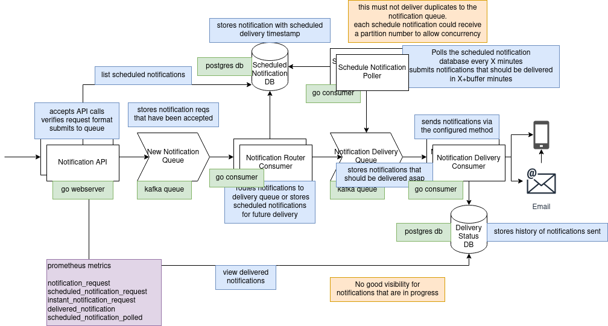

# Notifi

### todo
- [ ] custom errors 
- [ ] api response types, entity -> response
- [ ] poll postgres for scheduled notifications and submit to delivery queue
- [ ] figure out how to partition/shard db polling for scaling (random number column with consistent hashing?)
- [ ] prevent spam when db is down and notification is sent successfully
- [ ] add api service tokens, count messages per token in metrics
  - [ ] admin endpoints to manage create service tokens
- [ ] add prometheus metrics
- [ ] set up k8s
- [ ] add tests