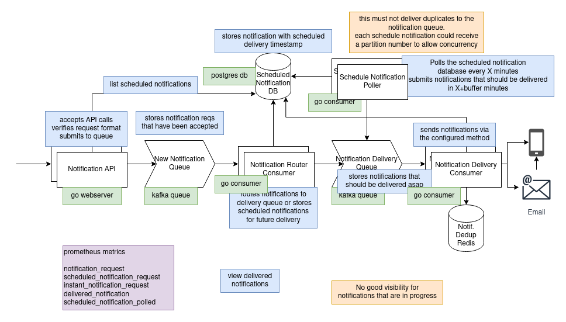

# Notifi

### todo
- [x] custom errors 
- [ ] api response types, entity -> response
- [ ] bulk notifications, same content, many destinations?
- [x] poll postgres for scheduled notifications and submit to delivery queue
  - [x] assign notifications to random partition key, assign partition range to each poller replica
- [x] prevent spam when db is down and notification is sent successfully
- [x] add api service tokens
  - [ ] count messages via service client id and prometheus
  - [x] do this through cloudflare access service tokens
- [x] add prometheus metrics
- [x] set up k8s
- [x] add tests
- [ ] schemas for all events in protobuf
